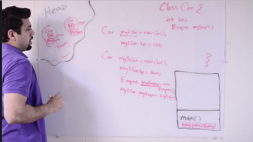

##Instructions
- We have a list of instructions. We put these instructions into methods after we break it down. 
- We call all of this methods in our main method.

##Class 
1. Place where you can define your methods. 
2. Container of methods.
3. Method is a container of instructions in which I program will perform

##Constructor 
1. Used to construct your program

##Objects
1. We use constructor to construct objects of a class
2. Objects are a runtime concept. Don't exist until app runs

##Java Behind the Scenes
Everything in java should be wrapped in named blocks, or methods. 
These would be the instructions for the computer. Methods are what does all the
work. AKA The main method.

#####What happens when you hit the run button?
1. Two memory locations that become reserved for the java app to run successfully.
   - One area is referred to as the ```` stack ```` and the other is ```` heat ````
2. Stack
  - When you hit the run button a frame is going to be created with the main
    method inside.
  - Within main are your local variables and these are where they are run. 
  - If you have a method ``` doWork(); ``` within the main method, this will be run and added to
    the stack on top of main.
  - Variables inside ``` doWork(); ``` get added within the frame of ``` doWork(); ```
  - You can further invoke other methods within ``` doWork(); ``` called ``` doMore(); ```. This
    now gets added to the stack on top of ``` doWork(); ```
  - Once the methods are finished running or completed, they are removed from the stack. Therefore once ``` doMore(); ``` is complete it is removed and so on. Eventually, once the application is finished running the main method will be popped off the stack.

3. Heap - created when the JVM starts up and may increase or decrease in size while the application runs. When the heap becomes full, garbage is collected. During the garbage collection objects that are no longer used are cleared, thus making space for new objects.
  - Inside the main method we're going down line by line and then we have the code ``` Car myCar ```
  - ```myCar ``` goes into the frame within ``` main(); ``` 
  - We assign ``` myCar = newCar(); ``` 
  - ``` myCar ``` does not contain the object. This is not a regualr variable, but is referred to as a reference variable.
  - ``` myCar ``` does not contain the actual object. It contains an address for the actual object so that we can reference it later.
  - If we assigned myCar to another object, then myCar will not contain the old address, but a new address which is now added to the Heap.
    - Garbage Collection
    - If the above happens then we have lost connection with the old Car object.
    - Garbage Collection is a process that looks for objects not being referenced and then deletes/removes them.


4. Reference Variables
  - Variables that don't contain the actual object, but a reference to where the object is on the heap.
5. Instance Variables
  - Variable that belongs to a particular instance.
  - Can have many instances within the same class.
  - A class with some variables in it, are instance variables.
  - Instance variables hold the address of the object.


## Interface
1. Interface is a contract.
2. Any class that implements that interface the interface wants that class to promise that it will implement that method
3. Remeber: A class can only extend one other class, which means it can only have one parent
4. You will only ever have one parent class

##Abstract Classes
1. A regualr class with metrics, methods, etc. However, it has abstract methods
   in it.
2. Abstract class can only be extended. It cannot instantiate an instance of an abstract class.
3. It is only meant to be a parent of another class.
4. You cannont create an instance of an abstract class.
